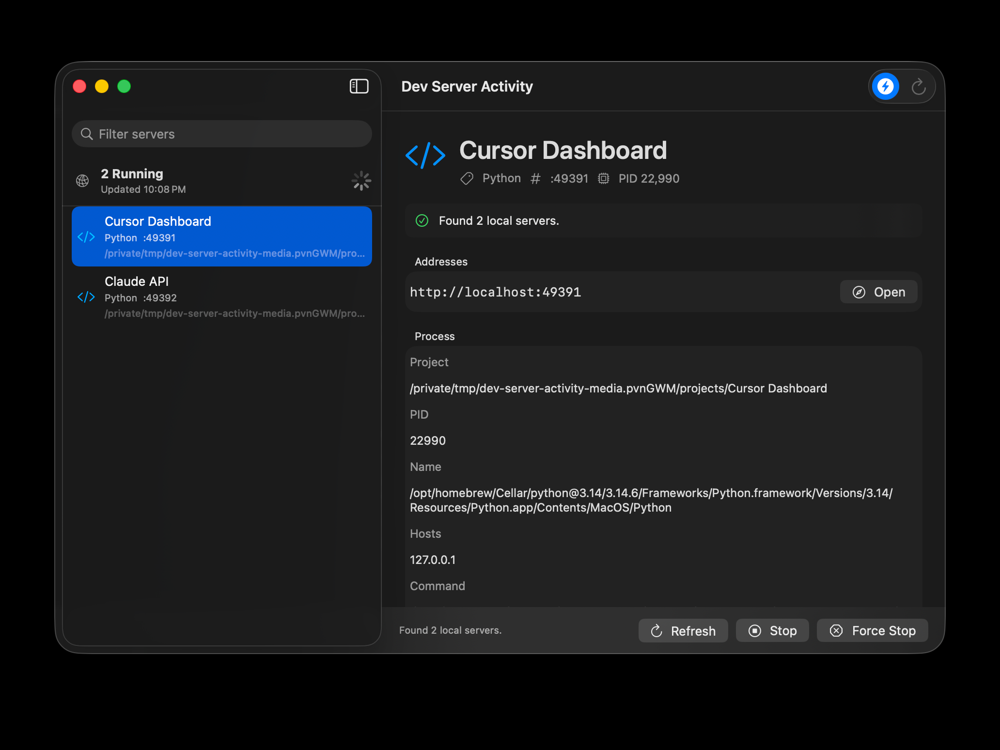

# Dev Server Activity

A native Mac app for finding local development servers that are still running and stopping only the ones you choose.

[](https://github.com/joeyarcisz/dev-server-activity/actions/workflows/ci.yml)
[](https://github.com/joeyarcisz/dev-server-activity/releases/latest)
[](LICENSE)



## Why it exists

I built Dev Server Activity after opening it and discovering at least 12 local development servers I did not know were still running. `lsof` and `ps` had the raw facts, but I wanted the project folder, full command, PID, hosts, and listening ports in one place before stopping anything.

A port number is not an identity. The app keeps the choice with the person at the keyboard and checks the selected process again immediately before sending a signal.

## Download

Download the current Apple-silicon build from [GitHub Releases](https://github.com/joeyarcisz/dev-server-activity/releases/latest).

The release is signed with a Developer ID certificate, notarized by Apple, and requires macOS 14 or later.

1. Download the ZIP and expand it.
2. Move **Dev Server Activity.app** to Applications.
3. Open the app normally.

Each release includes a SHA-256 checksum file. From the directory containing both downloads:

```bash
shasum -a 256 -c DevServerActivity-1.0.1-2-macos-arm64.sha256
```

With GitHub CLI installed, verify the repository's release-verification attestation:

```bash
gh attestation verify DevServerActivity-1.0.1-2-macos-arm64.zip \
  --repo joeyarcisz/dev-server-activity \
  --predicate-type https://in-toto.io/attestation/release/v0.1
```

The expected Gatekeeper source is `Notarized Developer ID`. Do not bypass a macOS warning for a copy that fails verification.

## What it does

- Finds likely local dev servers owned by the current macOS user.
- Recognizes Vite, Next.js, Node.js, Python, Ruby, PHP, Bun, and Deno processes.
- Shows the project folder, process name, command, PID, listening ports, and hosts.
- Opens a selected localhost address in the default browser.
- Filters the server list and refreshes it automatically every six seconds.
- Sends `SIGTERM` for **Stop** or `SIGKILL` for **Force Stop**, after confirmation.

When full process inspection is unavailable, the app can still probe a fixed list of common localhost ports. Those results are clearly marked as port-only and cannot be stopped from the app.

## Process safety

Stopping a process is consequential, so the confirmation freezes the exact server shown in the dialog. Dev Server Activity records that process's launch time, then requires the same PID and launch time before and after revalidating its command line and listening ports. If any check fails, nothing is stopped and the list is refreshed.

**Force Stop** can end a process without allowing it to save state. Review the process details and try **Stop** first.

The app has no privileged helper and does not request administrator access. It can signal only processes allowed by the current macOS user account.

See [Architecture](docs/ARCHITECTURE.md) for the scan and termination flow.

Official release ZIPs are checked for local packaging metadata and receive a GitHub release-verification attestation after their published checksum, Developer ID signature, stapled notarization ticket, and Gatekeeper acceptance are independently rechecked in GitHub Actions.

## Privacy

Dev Server Activity has no accounts, analytics, advertising, telemetry, or cloud service. Process inspection stays on your Mac. The app reads local process and listening-port information and connects only to localhost when probing or opening a server.

See [Privacy](PRIVACY.md) for the complete data-flow statement.

## Why the app is distributed directly

The app needs access to current-user process and listening-port information to identify and stop a selected server. The Mac App Sandbox restricts that access, so the full app is distributed as a signed and Apple-notarized download instead of through the Mac App Store.

## Build from source

Requirements:

- macOS 14 or later
- Xcode 15.3 or later with Swift 5.10+

Run the tests:

```bash
swift test
```

Build and launch a local development copy:

```bash
./script/build_and_run.sh --verify
```

Local development builds do not need Joey's signing or notarization credentials. Maintainer release steps are documented in [Direct distribution](docs/DIRECT_DISTRIBUTION.md).

## Contributing

Bug reports and focused pull requests are welcome. Read [Contributing](CONTRIBUTING.md) before changing process detection or termination behavior. Security-sensitive reports belong in the [private vulnerability form](https://github.com/joeyarcisz/dev-server-activity/security/advisories/new), not a public issue.

## License

The source code is available under the [MIT License](LICENSE). The Dev Server Activity name and app icon identify the original project; modified distributions should avoid implying that Joey Arcisz produced or endorsed them.
